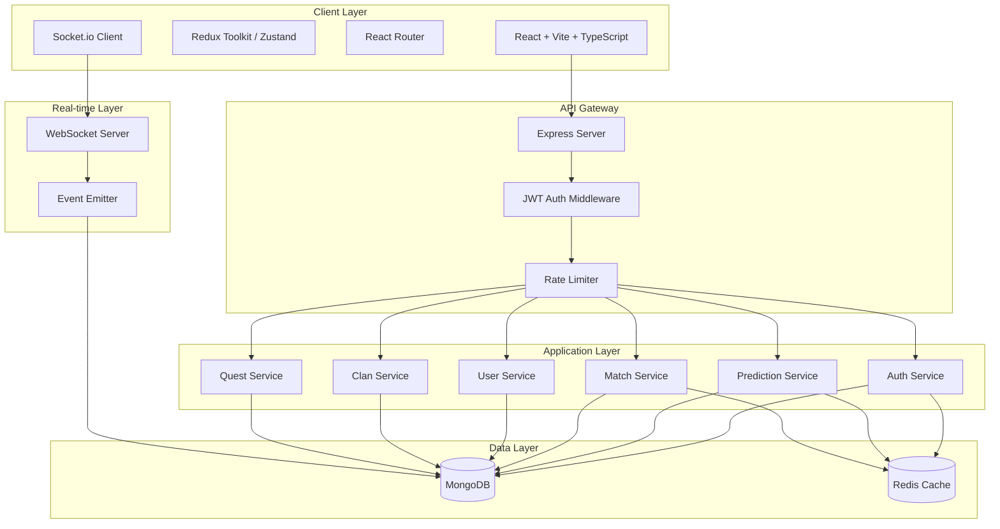

# FanVerseAI - Scalable Architecture Plan

## 🎯 Overview
Transform the single-file React application into a production-ready, scalable full-stack platform for cricket fan engagement with predictions, gamification, and real-time features.

## 📊 Current State Analysis

### Existing Features
- **Landing Page**: Hero section with app introduction
- **Dashboard**: User stats, live matches, activity charts
- **Prediction Arena**: Live match predictions with odds and commentary
- **Leaderboard**: Global rankings with clan affiliations
- **Clan Battles**: Team-based competitions
- **Profile**: User stats, badges, skill radar, battle pass
- **Quest Center**: Daily quests and AI-generated challenges

### Current Limitations
- Single 1381-line monolithic component
- Hardcoded mock data
- No backend or database
- No authentication
- No real-time updates
- Not production-ready
- No state management
- No routing
- No TypeScript

## 🏗️ Target Architecture

### High-Level Architecture



## 📁 Project Structure

```
fanverse-ai/
├── frontend/                    # React Frontend
│   ├── src/
│   │   ├── components/         # Reusable UI components
│   │   │   ├── common/        # Shared components (Badge, XPBar, etc.)
│   │   │   ├── layout/        # Layout components (Sidebar, Header)
│   │   │   └── features/      # Feature-specific components
│   │   ├── pages/             # Page components
│   │   │   ├── Landing/
│   │   │   ├── Dashboard/
│   │   │   ├── PredictionArena/
│   │   │   ├── Leaderboard/
│   │   │   ├── ClanBattles/
│   │   │   ├── Profile/
│   │   │   └── QuestCenter/
│   │   ├── store/             # State management
│   │   │   ├── slices/
│   │   │   └── store.ts
│   │   ├── services/          # API services
│   │   │   ├── api.ts
│   │   │   ├── auth.service.ts
│   │   │   ├── match.service.ts
│   │   │   ├── prediction.service.ts
│   │   │   └── websocket.service.ts
│   │   ├── hooks/             # Custom React hooks
│   │   ├── utils/             # Utility functions
│   │   ├── types/             # TypeScript types
│   │   ├── styles/            # Global styles
│   │   ├── App.tsx
│   │   └── main.tsx
│   ├── public/
│   ├── package.json
│   ├── vite.config.ts
│   ├── tsconfig.json
│   └── vercel.json            # Vercel deployment config
│
├── backend/                    # Node.js Backend
│   ├── src/
│   │   ├── config/            # Configuration
│   │   │   ├── database.ts
│   │   │   ├── redis.ts
│   │   │   └── env.ts
│   │   ├── models/            # MongoDB models
│   │   │   ├── User.ts
│   │   │   ├── Match.ts
│   │   │   ├── Prediction.ts
│   │   │   ├── Clan.ts
│   │   │   ├── Quest.ts
│   │   │   └── Badge.ts
│   │   ├── routes/            # API routes
│   │   │   ├── auth.routes.ts
│   │   │   ├── user.routes.ts
│   │   │   ├── match.routes.ts
│   │   │   ├── prediction.routes.ts
│   │   │   ├── clan.routes.ts
│   │   │   └── quest.routes.ts
│   │   ├── controllers/       # Route controllers
│   │   ├── services/          # Business logic
│   │   ├── middleware/        # Express middleware
│   │   │   ├── auth.middleware.ts
│   │   │   ├── validation.middleware.ts
│   │   │   └── rateLimit.middleware.ts
│   │   ├── utils/             # Utility functions
│   │   ├── websocket/         # WebSocket handlers
│   │   ├── types/             # TypeScript types
│   │   └── server.ts          # Entry point
│   ├── scripts/               # Utility scripts
│   │   └── seed.ts           # Database seeding
│   ├── package.json
│   ├── tsconfig.json
│   ├── Dockerfile
│   └── railway.json           # Railway deployment config
│
├── docker-compose.yml          # Local development setup
├── .github/
│   └── workflows/
│       └── ci-cd.yml          # CI/CD pipeline
├── README.md
└── package.json               # Root package.json
```

## 🗄️ Database Schema Design

### MongoDB Collections

#### Users Collection
```typescript
{
  _id: ObjectId,
  username: string,
  email: string,
  password: string (hashed),
  profile: {
    name: string,
    avatar: string,
    level: number,
    xp: number,
    xpMax: number,
    rank: number,
    persona: string,
    streak: number,
    clanId: ObjectId
  },
  stats: {
    totalPredictions: number,
    accuracy: number,
    questsDone: number,
    clanWars: number
  },
  badges: [ObjectId],
  createdAt: Date,
  updatedAt: Date
}
```

#### Matches Collection
```typescript
{
  _id: ObjectId,
  tournament: string,
  round: string,
  status: enum ['UPCOMING', 'LIVE', 'COMPLETED'],
  team1: {
    name: string,
    emoji: string,
    color: string,
    score: string,
    overs: string
  },
  team2: { /* same as team1 */ },
  momentum: number,
  odds: [number, number],
  commentary: [string],
  startTime: Date,
  endTime: Date,
  winner: string,
  createdAt: Date,
  updatedAt: Date
}
```

#### Predictions Collection
```typescript
{
  _id: ObjectId,
  userId: ObjectId,
  matchId: ObjectId,
  prediction: {
    winner: string,
    confidence: number,
    type: enum ['WINNER', 'SCORE', 'PLAYER']
  },
  result: enum ['PENDING', 'CORRECT', 'INCORRECT'],
  xpEarned: number,
  createdAt: Date,
  resolvedAt: Date
}
```

#### Clans Collection
```typescript
{
  _id: ObjectId,
  name: string,
  tag: string,
  emoji: string,
  color: string,
  level: number,
  members: [ObjectId],
  stats: {
    totalPoints: number,
    wins: number,
    losses: number,
    currentStreak: number
  },
  createdAt: Date,
  updatedAt: Date
}
```

#### Quests Collection
```typescript
{
  _id: ObjectId,
  type: enum ['DAILY', 'WEEKLY', 'AI_GENERATED'],
  icon: string,
  title: string,
  description: string,
  requirements: {
    type: string,
    target: number
  },
  rewards: {
    xp: number,
    badges: [ObjectId],
    coins: number
  },
  rarity: enum ['COMMON', 'RARE', 'EPIC', 'LEGENDARY'],
  expiresAt: Date,
  createdAt: Date
}
```

#### UserQuests Collection
```typescript
{
  _id: ObjectId,
  userId: ObjectId,
  questId: ObjectId,
  progress: number,
  completed: boolean,
  completedAt: Date,
  createdAt: Date
}
```

## 🔌 API Endpoints

### Authentication
- `POST /api/auth/register` - User registration
- `POST /api/auth/login` - User login
- `POST /api/auth/logout` - User logout
- `POST /api/auth/refresh` - Refresh JWT token
- `GET /api/auth/me` - Get current user

### Users
- `GET /api/users/:id` - Get user profile
- `PUT /api/users/:id` - Update user profile
- `GET /api/users/:id/stats` - Get user statistics
- `GET /api/users/:id/badges` - Get user badges
- `GET /api/users/:id/activity` - Get user activity history

### Matches
- `GET /api/matches` - Get all matches (with filters)
- `GET /api/matches/:id` - Get match details
- `GET /api/matches/live` - Get live matches
- `GET /api/matches/:id/predictions` - Get match predictions

### Predictions
- `POST /api/predictions` - Create prediction
- `GET /api/predictions/user/:userId` - Get user predictions
- `GET /api/predictions/:id` - Get prediction details
- `PUT /api/predictions/:id` - Update prediction (before match starts)

### Leaderboard
- `GET /api/leaderboard/global` - Global leaderboard
- `GET /api/leaderboard/clan/:clanId` - Clan leaderboard
- `GET /api/leaderboard/weekly` - Weekly leaderboard

### Clans
- `GET /api/clans` - Get all clans
- `GET /api/clans/:id` - Get clan details
- `POST /api/clans/:id/join` - Join clan
- `POST /api/clans/:id/leave` - Leave clan
- `GET /api/clans/:id/battles` - Get clan battles

### Quests
- `GET /api/quests` - Get available quests
- `GET /api/quests/user/:userId` - Get user quests
- `POST /api/quests/:id/start` - Start quest
- `POST /api/quests/:id/complete` - Complete quest
- `GET /api/quests/ai-generated` - Get AI-generated quests

## 🔄 Real-time Features (WebSocket)

### Events
- `match:update` - Live match score updates
- `match:commentary` - New commentary
- `match:momentum` - Momentum changes
- `leaderboard:update` - Leaderboard changes
- `clan:battle:update` - Clan battle updates
- `user:xp:gain` - XP gain notifications
- `user:level:up` - Level up notifications
- `user:badge:earned` - Badge earned notifications

## 🔐 Security Features

1. **Authentication**: JWT-based with refresh tokens
2. **Authorization**: Role-based access control (RBAC)
3. **Rate Limiting**: API rate limiting per user/IP
4. **Input Validation**: Request validation with Joi/Zod
5. **Password Security**: bcrypt hashing
6. **CORS**: Configured CORS policies
7. **Helmet**: Security headers
8. **SQL Injection**: MongoDB parameterized queries
9. **XSS Protection**: Input sanitization

## 📦 Technology Stack

### Frontend
- **Framework**: React 18 with TypeScript
- **Build Tool**: Vite
- **State Management**: Redux Toolkit or Zustand
- **Routing**: React Router v6
- **Styling**: Styled Components / Tailwind CSS
- **Charts**: Recharts
- **Real-time**: Socket.io Client
- **HTTP Client**: Axios
- **Form Handling**: React Hook Form
- **Validation**: Zod

### Backend
- **Runtime**: Node.js 20+
- **Framework**: Express.js with TypeScript
- **Database**: MongoDB with Mongoose
- **Cache**: Redis
- **Authentication**: JWT (jsonwebtoken)
- **Validation**: Joi or Zod
- **WebSocket**: Socket.io
- **Logging**: Winston
- **API Docs**: Swagger/OpenAPI
- **Testing**: Jest + Supertest

### DevOps
- **Containerization**: Docker
- **Local Dev**: Docker Compose
- **Frontend Hosting**: Vercel
- **Backend Hosting**: Railway or Render
- **CI/CD**: GitHub Actions
- **Monitoring**: Basic logging + error tracking

## 🚀 Deployment Strategy

### Frontend (Vercel)
1. Connect GitHub repository
2. Configure build settings (Vite)
3. Set environment variables
4. Auto-deploy on push to main

### Backend (Railway/Render)
1. Connect GitHub repository
2. Configure Dockerfile
3. Set environment variables
4. Configure MongoDB Atlas connection
5. Configure Redis instance
6. Auto-deploy on push to main

### Environment Variables
```env
# Frontend
VITE_API_URL=https://api.fanverseai.com
VITE_WS_URL=wss://api.fanverseai.com
VITE_ENV=production

# Backend
NODE_ENV=production
PORT=3000
MONGODB_URI=mongodb+srv://...
REDIS_URL=redis://...
JWT_SECRET=...
JWT_REFRESH_SECRET=...
CORS_ORIGIN=https://fanverseai.com
```

## 📈 Performance Optimizations

1. **Frontend**
   - Code splitting with React.lazy()
   - Image optimization
   - Memoization (useMemo, useCallback)
   - Virtual scrolling for long lists
   - Service Worker for offline support

2. **Backend**
   - Redis caching for frequently accessed data
   - Database indexing
   - Query optimization
   - Response compression
   - Connection pooling

3. **Real-time**
   - WebSocket connection management
   - Event throttling
   - Selective data broadcasting

## 🧪 Testing Strategy

1. **Frontend**: Component tests with React Testing Library
2. **Backend**: API tests with Jest + Supertest
3. **Integration**: End-to-end tests with Playwright
4. **Load Testing**: Basic load testing with Artillery

## 📊 Monitoring & Logging

1. **Application Logs**: Winston with log levels
2. **Error Tracking**: Basic error logging
3. **Performance**: Response time monitoring
4. **Health Checks**: `/health` endpoint
5. **Metrics**: Basic request/response metrics

## 🔄 Migration Path

1. **Phase 1**: Setup infrastructure (monorepo, configs)
2. **Phase 2**: Frontend refactoring (components, routing, state)
3. **Phase 3**: Backend development (API, database, auth)
4. **Phase 4**: Real-time features (WebSocket)
5. **Phase 5**: Deployment setup (Docker, CI/CD)
6. **Phase 6**: Testing & documentation
7. **Phase 7**: Production deployment

## 📝 Next Steps

1. Review and approve this architecture plan
2. Set up the project structure
3. Begin implementation following the todo list
4. Iterate and refine based on requirements

---

**Note**: This architecture is designed to be scalable, maintainable, and production-ready while keeping complexity manageable for a cricket fan engagement platform.